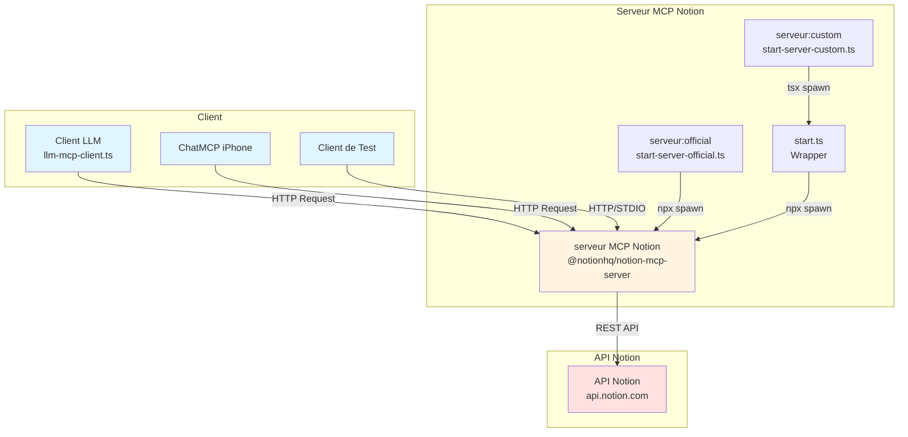
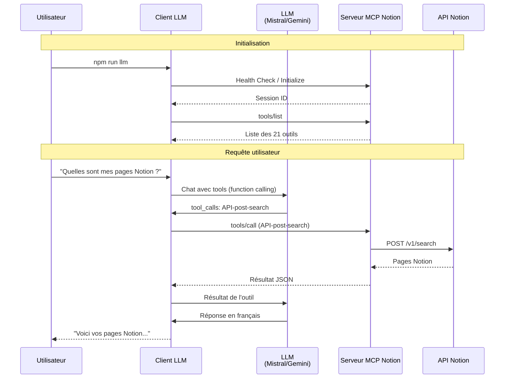
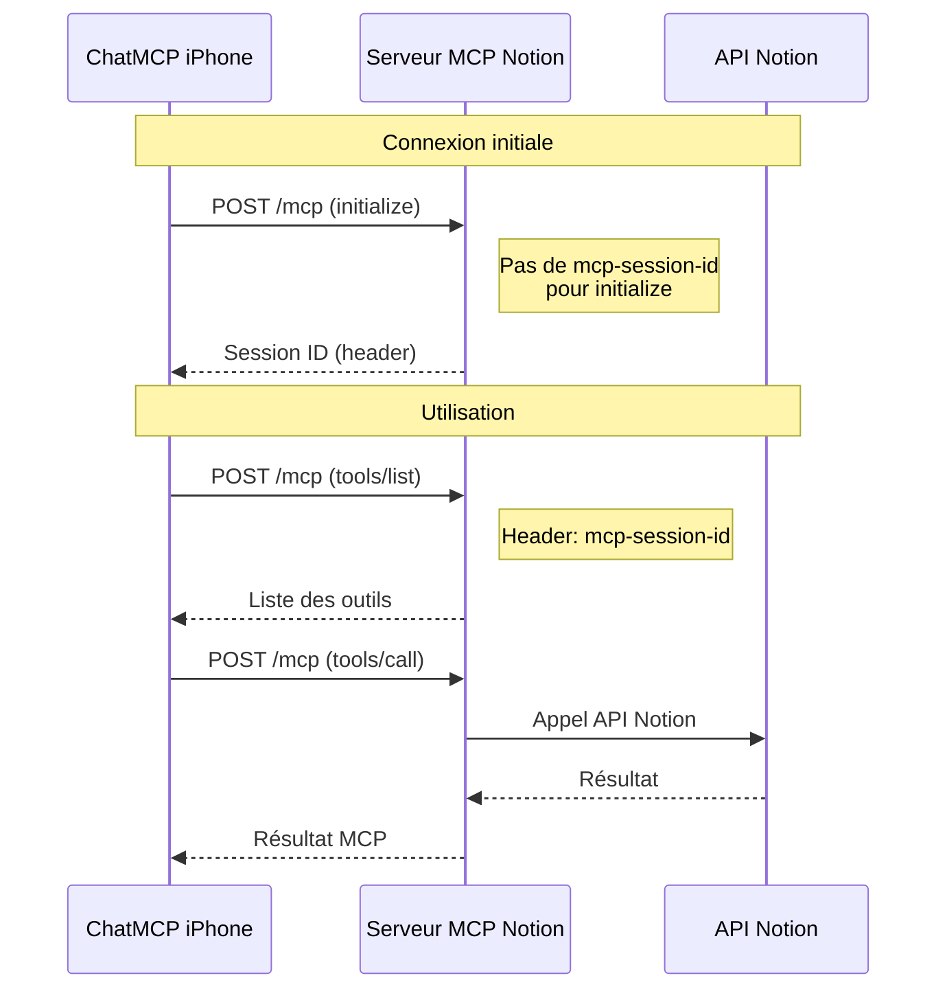
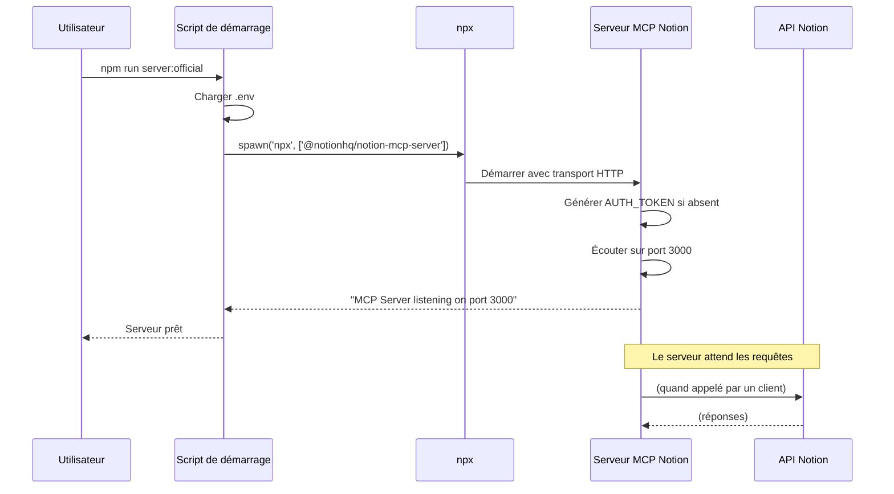
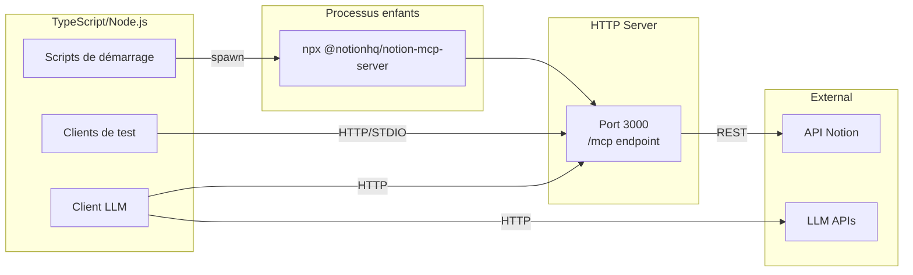
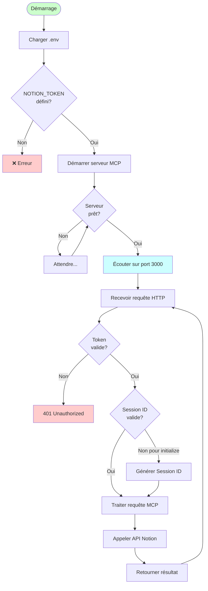
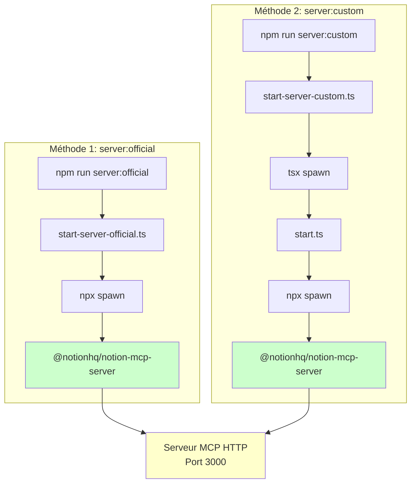

# Architecture du système

## Diagramme d'architecture

## Diagramme de séquence - Client LLM

## Diagramme de séquence - ChatMCP

## Diagramme de séquence - Démarrage du serveur

## Architecture des composants

## Flux de données

## Comparaison des méthodes de démarrage

**Différence principale :**
- `server:official` : Lance directement le serveur officiel (1 processus intermédiaire)
- `server:custom` : Passe par le wrapper `start.ts` (2 processus intermédiaires)

Les deux méthodes aboutissent au même résultat : le serveur MCP Notion officiel en HTTP.

